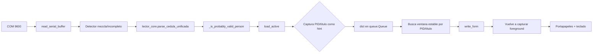
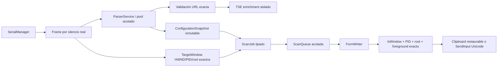
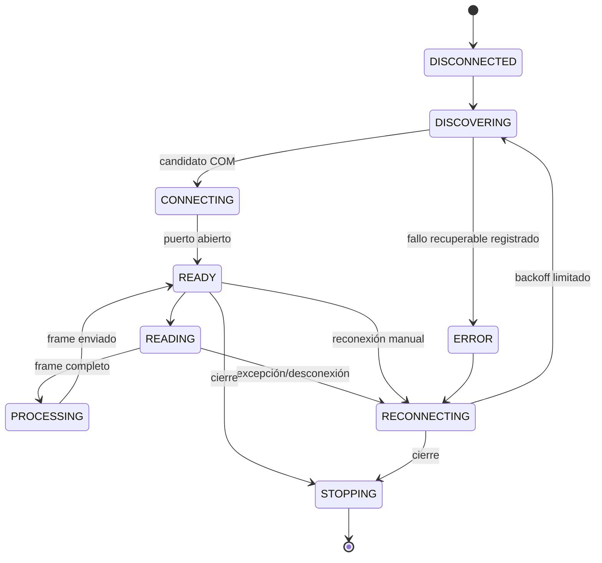
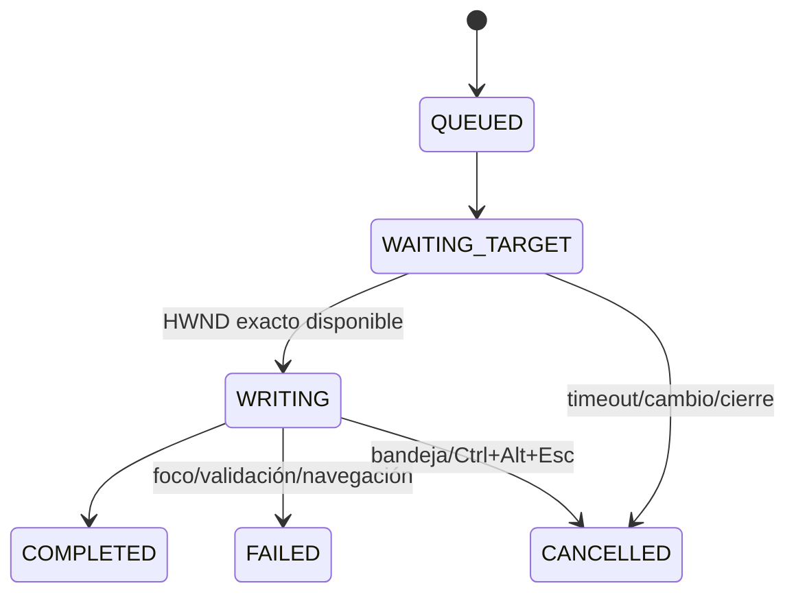

# Auditoría técnica y QA — Lector de Cédulas DMS

## Alcance y trazabilidad

- Repositorio: `Andri-Almengor/LectorCedulas`.
- Rama base: `main`.
- Commit base verificado: `0296d56d6ccfe2b75bef2e83169e77ec2b852272`.
- Rama de trabajo: `agent/qa-hardening-lector-cedulas`.
- Fecha de auditoría: 2026-07-22.
- La inspección cubrió la aplicación, runtime, configurador, parsers, formatos JSON, dashboard, updater, scripts de build, instalador y pruebas disponibles.

### Línea base

El repositorio contenía una única suite `tests/test_universal_writer_runtime.py` con cuatro pruebas simuladas del escritor. No existía workflow de CI ni separación por capas. El checkout completo no pudo ejecutarse localmente antes de los cambios porque el entorno de ejecución no resolvía `github.com`; la estructura, contenido y commit fueron verificados mediante la API de GitHub. Este límite se registra y no se presenta como una prueba aprobada.

Después del hardening se ejecutó en el entorno aislado:

```text
56 passed, 2 skipped in 1.37s
```

Estas son pruebas automatizadas y simuladas. No sustituyen Lenel, Windows interactivo, RDP, lector USB, antivirus, Inno Setup ni firma de código.

## Arquitectura encontrada

La entrada `template/main.py` configuraba `lector_core` mutando variables y funciones. Además, `template/assets/runtime/__init__.py` importaba cinco módulos que instalaban monkey patches por efecto lateral. El flujo efectivo dependía del orden de importación:

```text
main.py
  -> assets.runtime.__init__
     -> dms_console_session_guard
     -> dms_scan_queue_guard       (reemplaza reader.serial_listener)
     -> dms_universal_form_guard   (reemplaza reader.write_form y config.set_active)
     -> dms_writer_speed_guard
     -> dms_editor_profile_guard
  -> patch_core()                  (muta lector_core)
```

### Flujo anterior: bytes seriales a formulario



La ventana validada por la cola no era necesariamente la ventana que recibía la escritura.

## Arquitectura implementada

La entrada ahora instancia servicios explícitos sin monkey patches:



### Máquina de estados del lector



### Estados y control de cola



La cola permite pausa, reanudación, vaciado, cancelación actual, backpressure no bloqueante y política explícita de cancelar generaciones anteriores al cambiar configuración.

## Dependencias entre módulos nuevos

| Módulo | Responsabilidad | Dependencias relevantes |
|---|---|---|
| `app_runtime.py` | Composición, bandeja, licencia, ciclo de vida | todos los servicios |
| `serial_manager.py` | COM, descubrimiento, reconexión, métricas | `models.py` |
| `parser_service.py` | parsers aislados, TSE sin bloquear listener | core heredado, `url_security.py` |
| `scan_queue.py` | trabajos tipados y control de concurrencia | `models.py`, `writer.py` |
| `writer.py` | navegación y escritura universal | `windows_target.py` |
| `windows_control.py` | lectura segura de controles Win32/.NET | `writer.ControlProbe` |
| `config_service.py` | esquema, migración, validación y persistencia | `atomic_io.py` |
| `license_service.py` | firma Ed25519 y validación UTC | `cryptography` |
| `update_manifest.py` | manifest firmado, hashes, versión y rutas | `cryptography`, `packaging` |
| `privacy.py` | logs estructurados, redacción y rotación | stdlib |

## Hilos y recursos sincronizados

| Hilo/ejecutor | Propósito | Sincronización |
|---|---|---|
| `DMSSerialManager` | detectar, abrir, leer y reconectar COM | `RLock`, eventos stop/reconnect |
| `DMSParser-*` | parsear y consultar TSE fuera del listener | `ThreadPoolExecutor`, semáforo 128 |
| `DMSScanQueue` | único escritor secuencial | queue acotada, lock, cancel event |
| `DMSEmergencyHotkey` | Ctrl+Alt+Esc | evento de cancelación |
| `DMSStopEvent` | cierre cooperativo para updater | evento global Windows |
| selector de configuración | UI independiente | lock no bloqueante |

Recursos sincronizados: puerto activo, estado de cola, trabajo actual, generación de configuración, digest de lectura repetida, caché TSE y archivos JSON críticos.

## Persistencia

| Archivo/directorio | Contenido | Protección |
|---|---|---|
| `licencia.key` | envelope firmado, sin clave privada | firma Ed25519; permisos restrictivos cuando aplica |
| `assets/license_public_key.pem` | clave pública de licencias | solo verificación |
| `assets/update_public_key.pem` | clave pública de updates | solo verificación |
| `configs/formularios/*.json` | navegación y políticas | esquema v2, backup y escritura atómica |
| `configs/sistema/config_actual.json` | formulario activo | atómico; no fallback silencioso |
| `configs/sistema/favoritos.json` | dos favoritas | atómico y referencias reparadas |
| `configs/sistema/ultimo_com.json` | identidad USB/COM | sin PII; atómico |
| `configs/sistema/instalacion.json` | UUID local opcional | no identifica a una persona |
| `configs/sistema/licencia_estado.json` | hash y último UTC observado | anti-retroceso de reloj |
| `logs/lector.log*` | eventos técnicos redactados | rotación; sin payload de persona |

## Datos personales tratados

- Número de cédula.
- Nombre y apellidos.
- Sexo.
- Fechas de nacimiento, emisión y expiración.
- Lugares de nacimiento/residencia.
- Nombre de padre/madre en formatos que lo contienen.
- RAW y tokens TSE, únicamente durante procesamiento en memoria.

Se clasifican como información personal sensible para el producto. El modo normal no persiste RAW ni valores completos.

## Hallazgos y estado

| ID | Severidad | Problema y evidencia exacta en base | Reproducción | Corrección | Prueba de regresión | Estado |
|---|---|---|---|---|---|---|
| QA-001 | P1 | `dms_scan_queue_guard.py:46-90,119-140` esperaba por PID/título y `dms_universal_form_guard.py:41-43` recapturaba foreground | Escanear en Chrome A y activar Chrome B del mismo proceso | `ScanJob.target` contiene HWND/PID/root exactos; escritor recibe ese objeto | escritor usa solo target del job; URL/queue tests | Corregido automatizadamente |
| QA-002 | P1 | `_wait_for_stable_target` no tenía deadline | Cerrar formulario después de escanear | timeout de objetivo por perfil; cancela sin redirigir | `target_unavailable`; matriz M-013 | Corregido en diseño; físico pendiente |
| QA-003 | P1 | `_enqueue_read` reintentaba `put` eternamente con cola llena | llenar 64 trabajos | `put_nowait`, error visible y serial continúa | `test_queue_full_is_nonblocking_backpressure` | Corregido |
| QA-004 | P1 | licencia sin firma; caché prioritario; fechas naive; borrado al expirar en `lector_core.py:145-170` | editar `expira`, renovar dejando cache viejo | envelope Ed25519, UTC aware, fuente única, estado anti-clock; no borra licencia | 11 pruebas de licencia | Corregido automatizadamente |
| QA-005 | P1 | `serial_listener` terminaba al lanzar excepción, sin reconexión | desconectar USB | máquina de estados y backoff 0.5–8 s | `test_reconnect_state_after_disconnect` | Simulado; físico pendiente |
| QA-006 | P1 | calibración aceptaba longitud y consumía primera lectura | primer scan tras inicio | descubrimiento no requiere calibración destructiva; primera lectura válida se procesa y confirma identidad | `test_fragmented_first_scan_is_submitted_not_lost` | Simulado; físico pendiente |
| QA-007 | P1 | `session.log(data)` y `guardar_raw_no_reconocido` persistían PII/RAW completo | escanear cualquier documento | logs allowlist/redactados; no guardado RAW normal | pruebas de privacidad | Corregido |
| QA-008 | P1 | host mdoc validado por substring; TSE síncrono, redirects/tamaño sin límite | URL `servicioidc.tse.go.cr.evil` o respuesta grande | `urllib.parse`, HTTPS/host/puerto/credenciales exactos; no redirects; 512 KB; pool independiente | URL y parser tests | Corregido automatizadamente |
| QA-009 | P1 | config corrupta devolvía default/primera disponible | corromper activa o formulario | error explícito y escritura bloqueada | config corrupta/missing tests | Corregido |
| QA-010 | P1 | update contenía `updater.py`, manifest sin firma/hashes y exe aleatorio | generar update y revisar payload | updater EXE, manifest Ed25519, SHA-256, downgrade block, backup/stage/rollback | manifest tests; instalación física pendiente | Parcial: código listo, build Windows pendiente |
| QA-011 | P2 | versiones 3.9.3, dashboard 2.0.0 e Inno 4.0 divergían | comparar archivos | `hardened/version.py` fuente única `4.0.0-qa1` | import/version workflow | Corregido |
| QA-012 | P2 | runtime instalaba patches al importarse | cambiar orden de importación | `runtime/__init__.py` queda sin side effects; composición explícita | compileall/import tests | Corregido |
| QA-013 | P2 | prioridad `BELOW_NORMAL` podía afectar precisión | CPU alta | nueva app no reduce prioridad | matriz M-019 | Corregido en código; físico pendiente |
| QA-014 | P2 | cualquier error Inno reintentaba sin icono | provocar error distinto a 110 | solo reintenta si stdout/stderr contiene `EndUpdateResource` y `110` | revisión de builder; Windows pendiente | Corregido en código |
| QA-015 | P2 | no había cancelación de escritura | iniciar escritura lenta | bandeja y Ctrl+Alt+Esc, liberación de modificadores en `finally` | writer/queue tests | Simulado; físico pendiente |
| QA-016 | P2 | normalización eliminaba signos y tildes | comparar MUÑOZ/MUNOZ | comparación NFC conservando signos | prueba de nombres | Corregido |
| QA-017 | P2 | `Ctrl+A` podía aplicarse sin control exacto | checkbox, browser o superficie no legible | solo reemplaza si control enfocado exacto es legible; si no, falla seguro | `test_unreadable_control_never_uses_ctrl_a` | Corregido |
| QA-018 | P2 | portapapeles previo no se restauraba | copiar texto, escanear | sesión de clipboard restaura texto; formatos no restaurables no se modifican y usa SendInput Unicode | writer test; físico pendiente | Corregido con limitación documentada |
| QA-019 | P2 | tiempos custom aceptaban NaN/infinito/absurdos | editar JSON | límites finitos de tabs y esperas | config parameterized tests | Corregido |
| QA-020 | P3 | generated `_build` y clientes aparecían en historial | inspección de árbol | `.gitignore`; eliminación de artefactos rastreados prevista | revisión Git | Corregido en rama |

## Monkey patches encontrados

1. `dms_scan_queue_guard` reemplazaba `reader.serial_listener`.
2. `dms_universal_form_guard` reemplazaba `reader.write_form`.
3. `dms_universal_form_guard` envolvía `config.set_active`.
4. `main.patch_core()` reemplazaba rutas, funciones, pausas y clases en `lector_core`.
5. Guards Lenel históricos también quedaban disponibles en el árbol.

Los archivos legacy se conservan para referencia/compatibilidad de build, pero la entrada nueva no los importa ni depende de ellos.

## Variables globales compartidas encontradas

- `session.STOP`, `_active_serial`, `_tray_icon`, `_logger`.
- `_scan_queue`, `_last_target_pid`, `_last_completed_at`, `_last_digest`.
- `_write_lock`, `_configuration_generation`.
- tiempos y perfiles mutados sobre `lector_core`.

La nueva composición encapsula estos estados por instancia y usa objetos inmutables para configuración y destino.

## Riesgos pendientes

1. **Pruebas físicas P1 de liberación:** no se han ejecutado 100/100 y 500/500 con lector y Lenel.
2. **Firma Authenticode:** el pipeline contempla binarios y setup, pero no hay certificado real en el repositorio; pendiente de infraestructura segura.
3. **Validación en navegador/WPF no legible:** el fallback escribe de forma universal, pero no afirma validación cuando el control no expone texto por Win32. Requiere prueba y, si se exige lectura programática, adaptador UI Automation firmado y probado.
4. **mDoc/TSE cambiante:** el reconocimiento seguro está cubierto; el HTML oficial puede cambiar y requiere fixture contractual sin datos reales.
5. **Bit-for-bit reproducibility:** dependencias están fijadas y build limpio, pero PyInstaller/Inno y firma Authenticode pueden introducir timestamps; se debe comparar artefactos en dos agentes Windows controlados y documentar diferencias esperadas.
